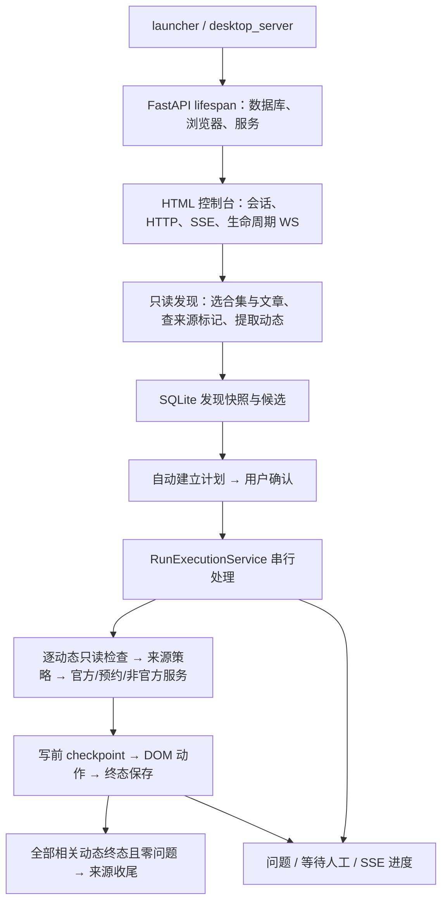

# 代码导读与逐文件职责

审查基线：v1.5.3，提交 `8b6f888`；审查日期：2026-09-19。

配套文档：[冗余审查与精简建议](冗余审查与精简建议.md)。

## 1.5.5 结构更新（2026-09-20）

阶段 1～5 的修改已经落地；下方原清单保留为 v1.5.3 审查基线。新结构及测试见 [阶段4-5实施与构建记录](阶段4-5实施与构建记录.md)。

| 文件或目录 | 当前职责 |
| --- | --- |
| backend/domain/json_utils.py | 持久化 JSON 对象的容错读取 |
| backend/db/repositories/activities.py | 批量加载并按活动分组来源上下文 |
| backend/use_cases/run_execution.py | 串行运行编排、写入服务分派和事件发布 |
| backend/use_cases/run_execution_state.py | 队列、恢复、重启和结果落库 |
| backend/use_cases/run_execution_inspection.py | 只读运行检查与来源策略 |
| backend/use_cases/run_execution_outcomes.py | 不可变检查结果及状态转换 |
| backend/activity_engine/shared/dom_read.py | 可见候选、文字/属性读取和只读轮询 |
| backend/activity_engine/shared/author_location.py | 根据调用方规则收集精确作者身份 |
| backend/source_adapters/compatibility.py | 旧 dict 选择结果和旧观察接口的兼容入口 |
| backend/domain/ports.py | 统一来源接口与一次页面观察结果 |
| backend/legacy/ | 旧来源点赞计划、执行和受控写入工具；原 use_cases 路径保留公开兼容导出 |
| frontend/src/features/discovery/source-profile.ts | 两个页面共用的来源选择、信息和操作区域 |

## 1. 范围与阅读方法

本项目是“本地 HTML 控制台 + FastAPI 服务 + SQLite + Playwright 浏览器”的桌面工具，不是纯网页，也不是靠直接写入 B 站私有 API 完成业务的脚本。

以本次开始时 `git ls-files` 的 **196 个文件**为清单基准：后端 **115 个 Python 文件、14,287 行**，其中 **28 个是包入口 `__init__.py`**；前端 src 中 **14 个非测试 TypeScript 文件**、3 个测试文件及 CSS；后端 **35 个测试模块**，另含构建、契约、历史证据与文档。行数包含空行/注释，不是有效业务复杂度指标。

阅读以生产调用链和实现为主；测试逐模块梳理用例，并重点核对状态机、重启、来源合并和计划生成相关的断言/测试替身。附录逐文件说明作用，而不是把测试枚举当成全量运行验证。依赖锁与历史证据按用途/结构审查，不逐项解释第三方包实现。

排除第三方依赖和生成物：`.venv`、`node_modules`、`build`、`dist`、`web_static/dist`、浏览器资料、用户数据库和缓存。没有读取用户 Cookie/Key，没有访问 B 站或执行评论、转发、关注、点赞；本次仅新增说明文档，不修改业务代码、版本或 GitHub 仓库。

## 2. 一张图理解主链路

### 2.1 启动和关闭

1. `backend/launcher.py` 调用桌面服务。
2. `desktop_server.py` 检查本机端口和应用身份。已经是助手则打开已有页面；无关程序占用端口则拒绝接管。
3. `api/app.py` 在 lifespan 中创建 engine、表/兼容字段、来源种子、BrowserManager、EventHub、JobRunner 和各业务服务。
4. Vite 构建资源从 `web_static/dist` 提供；`main.ts → bootstrap.ts` 获取 CSRF Token、连接生命周期 WS、加载视图并订阅 SSE。
5. 页面 WS 表示桌面 UI 是否仍存在。最后连接断开后有 3 秒宽限；刷新重连可取消退出。SSE 用于事件通知，两者职责不同，不应合并成一个连接的模糊语义。

### 2.2 只读发现与双来源

来源配置不是“每个主页一个独立运行”的硬编码，而是 `SourceProfile.config_json.sourcePages` 可以包含多个主页；适配器依次检查主页后汇总候选。

| 内置来源 | 合集选择 | 文章选择 | 允许的运行时类型 |
| --- | --- | --- | --- |
| 你的抽奖工具人：100680137 + 280604312 | 前者普通/官方两族分别取最大后缀合集；后者名称精确为“抽奖合集”；按主页+类别分别选 | 每个选中合集按来源序号取最新 5 篇 | official、unofficial |
| 糯米是个背包：492426375 | 四位年份名称中最大年份 | 按来源序号取最新 3 篇 | official、reservation |
| 番茄薯条喵：3546836235193146 | 精确名称“互动抽奖” | 按发布时间优先取最新 3 篇；只保留预约/互动分区 | official、unofficial、reservation |

这里“每类最新 5”在现行实现中是**每个选中合集 5 篇**，不是两个主页总共 5 篇。工具人若选中 3 个合集且文章互不重复，可检查 15 篇；这与来源自动收尾默认上限 10 的关系见审查报告。

发现时先用只读 HTTP 接口获取合集/文章，再通过已登录浏览器检查来源文章点赞状态。已点赞跳过，未知进入人工复核，未点赞才解析正文。正文规则保留链接顺序、跳过置顶/汇总等非目标链接，并对动态去重。**此阶段不会批量打开候选动态。**

`family` 是来源归类（normal/official），`source_section` 是来源文章提供的分段线索（interactive/reservation），`mode` 是执行时页面判断（official/unofficial/reservation/unknown）。三者不能互相替代。“互动”的界面标签也不等于内部 `official` 必然有官方面板。

### 2.3 计划与执行

- 发现成功且有候选，`AutomaticExecutionPlanService` 建立 `awaiting_confirmation` 计划；已有计划复用，空候选不建空运行。
- `ExecutionPlanService` 选择、排序候选，固定目标及来源列表，保存每条动作计划；用户确认后才排队。
- `JobRunner` 保持全局单任务槽，避免发现和执行同时操作同一浏览器。
- `RunExecutionService` 逐条读取页面：确认目标、等待渲染、优先检查点赞，再判类型和来源白名单。
- 已点赞可直接跳过；缺失/歧义点赞状态不能硬猜为未点赞；无法可靠确认的页面进入人工处理。
- 官方/预约服务负责授权和账本，DOM transport 负责可见控件读写；非官方服务负责生成评论、补全要求和逐动作 checkpoint。
- 非官方普通和加码当前均采用评论同步转发路径，确认同步转发后不再次单独转发。评论发布点击正常返回 `COMMENT_SUBMIT_ACCEPTED`，表示提交已被接受，**不等于已在评论列表回查确认显示**。
- 未知写入结果禁止自动重试；“重新开始”只重检查当前问题条目，不重放已完成条目。可安全清理的写前失败与已经确认/未知副作用的记录有不同规则。

### 2.4 来源收尾

`source_closure.py` 只计算是否可收尾，不点击：同一来源关联动态全部终态、无开放问题、来源未处理，才生成 `ready_to_mark`。

`source_like_automation.py` 才进行运行范围内的来源点赞，另有开关、数量上限、单次账本、随机等待与未知结果停止。动态点赞是活动参与标记；来源文章点赞是文章内全部活动完成标记，不能因为控件 CSS 相似就混为同一种授权。

## 3. 数据模型与边界

数据库共有 **11 张业务表**，分工如下：

| 表 / 模型 | 保存什么 | 与其他表的关系 |
| --- | --- | --- |
| source_profiles / SourceProfile | 来源和双主页配置 | 一来源多次发现、多合集 |
| readlists / Readlist | 合集名称、类别、来源主页、更新时间 | 通过成员表关联文章 |
| source_articles / SourceArticle | 文章 URL、点赞/解析最近状态 | 可属于多合集并包含多动态 |
| readlist_entries / ReadlistEntry | 合集成员及原序号 | readlist + source_article 复合键 |
| discovery_runs / DiscoveryRun | 一次发现状态、所选合集和统计 | 所属来源；关联选文和计划 |
| discovery_selections / DiscoverySelection | 本轮所选文章、排名及点赞决策快照 | discovery + source_article 复合键 |
| activities / Activity | 全局动态与最近运行时检查结果 | dynamic_id 全局唯一 |
| activity_origins / ActivityOrigin | 文章到动态的位置/分段、发现批次 | 当前键仅 article + activity；历史覆盖问题见报告 |
| runs / Run | 确认范围、运行状态、统计/写入账本 JSON | 关联发现 |
| run_items / RunItem | 本轮每条动态顺序、检查快照和结果 | run + activity 复合键 |
| problem_records / ProblemRecord | 问题网址、阶段、原因、安全详情 | 关联发现/来源并阻止不安全收尾 |

看似重复但有必要的存储：

- `Activity` 的最近状态不等于 `RunItem` 的历史快照；不同运行必须能独立解释。
- 数据库写入 checkpoint 不等于前端 SSE 日志。前者决定能否安全恢复，后者是可能丢消息的通知。
- `source_section` 是发现线索，`mode` 是动态页面事实，两者应并存；当前创建计划的赋值错误不能靠删掉字段解决。
- JSON 中有历史兼容字段，不应仅因当前页面不显示就直接清除。

## 4. 逐文件职责清单

下表路径相对于仓库根。链接可直接打开文件；行数为审查基线统计，包含注释与空行。包入口仍逐个列出，避免把“文件多”误判为业务实现重复。

### 4.1 后端入口、配置与 HTTP

| 文件 | 行数 | 职责 / 边界 |
| --- | ---: | --- |
| [backend/__init__.py](../backend/__init__.py) | 2 | 包标记/模块说明，不承载业务流程。 |
| [backend/api/__init__.py](../backend/api/__init__.py) | 2 | 包标记/模块说明，不承载业务流程。 |
| [backend/api/app.py](../backend/api/app.py) | 141 | FastAPI 组装根；lifespan 初始化数据库、来源配置、浏览器、任务队列、事件与各用例服务；注册路由/静态前端，退出时释放资源。 |
| [backend/api/dependencies.py](../backend/api/dependencies.py) | 58 | 从请求取得应用服务状态，验证本机会话 CSRF Token，避免接口处理函数重复访问 app.state。 |
| [backend/api/routes/__init__.py](../backend/api/routes/__init__.py) | 2 | 包标记/模块说明，不承载业务流程。 |
| [backend/api/routes/desktop.py](../backend/api/routes/desktop.py) | 44 | 桌面生命周期 WebSocket；校验子协议/会话 Token，登记页面连接和断开。 |
| [backend/api/routes/discoveries.py](../backend/api/routes/discoveries.py) | 157 | 启动来源发现；后台顺序执行发现与自动计划；查询发现预览、候选、来源关系和统计并序列化。 |
| [backend/api/routes/events.py](../backend/api/routes/events.py) | 32 | 把 EventHub 队列转换为 SSE 流；客户端断开时取消订阅。 |
| [backend/api/routes/health.py](../backend/api/routes/health.py) | 38 | 应用身份、版本、浏览器就绪状态及本机会话 Token 接口。 |
| [backend/api/routes/preflight.py](../backend/api/routes/preflight.py) | 13 | 已移除批量预检的兼容端点，返回 410；不提交任务、不访问活动页面。 |
| [backend/api/routes/problems.py](../backend/api/routes/problems.py) | 42 | 查询问题网址记录，让前端解释暂停原因。 |
| [backend/api/routes/runs.py](../backend/api/routes/runs.py) | 308 | 计划创建、查询、确认、开始、继续、重启、来源收尾查询；映射 HTTP 错误并序列化运行快照。 |
| [backend/api/routes/settings.py](../backend/api/routes/settings.py) | 93 | 读取/修改进程内 DeepSeek 与提及账号配置；Key 只写不回显，校验账号数量和 API 地址。 |
| [backend/api/routes/sources.py](../backend/api/routes/sources.py) | 85 | 来源配置列表及登录页入口；将双主页配置暴露给前端。 |
| [backend/config.py](../backend/config.py) | 77 | 运行配置与环境变量（BILI_）；版本、端口、数据路径、浏览器通道、自动执行开关、延时、来源收尾上限、DeepSeek 与固定提及账号；get_settings 缓存配置。 |
| [backend/launcher.py](../backend/launcher.py) | 11 | 程序主入口；调用桌面服务启动逻辑，也是 pyproject 注册的命令入口和 PyInstaller 入口。 |

### 4.2 浏览器、桌面运行、任务与命令行

| 文件 | 行数 | 职责 / 边界 |
| --- | ---: | --- |
| [backend/browser/__init__.py](../backend/browser/__init__.py) | 4 | 包标记/模块说明，不承载业务流程。 |
| [backend/browser/locator_utils.py](../backend/browser/locator_utils.py) | 11 | stable_class_state 连续读取 CSS class 判断稳定状态；当前仓内没有调用点，是清理候选而非核心状态机。 |
| [backend/browser/manager.py](../backend/browser/manager.py) | 191 | 管理 Playwright 持久化浏览器；登录页与任务页分离，串行创建/导航，复用或恢复已关闭的上下文。 |
| [backend/cli/__init__.py](../backend/cli/__init__.py) | 1 | 包标记/模块说明，不承载业务流程。 |
| [backend/cli/run_official_automation.py](../backend/cli/run_official_automation.py) | 147 | 命令行执行已有且已确认的官方运行；验证目标范围、输出安全事件/最终快照、退出时关闭浏览器；不是混合任务通用 CLI。 |
| [backend/jobs/__init__.py](../backend/jobs/__init__.py) | 5 | 包公共入口，集中重新导出本目录服务/数据类型，供调用方稳定导入；不是重复实现。 |
| [backend/jobs/events.py](../backend/jobs/events.py) | 33 | 进程内事件总线；每个订阅队列最多 100 条，满时丢弃最旧事件，不是持久化日志。 |
| [backend/jobs/runner.py](../backend/jobs/runner.py) | 54 | 全局单任务槽，提交/取消 asyncio 任务和发布任务事件；已完成任务目前仍保留在 _tasks。 |
| [backend/runtime/__init__.py](../backend/runtime/__init__.py) | 5 | 包公共入口，集中重新导出本目录服务/数据类型，供调用方稳定导入；不是重复实现。 |
| [backend/runtime/desktop_lifecycle.py](../backend/runtime/desktop_lifecycle.py) | 101 | 页面连接计数与关闭宽限期；最后一个页面断开后请求关闭，刷新重连取消关闭。 |
| [backend/runtime/desktop_server.py](../backend/runtime/desktop_server.py) | 117 | 识别已有助手实例、拒绝抢占无关端口、启动 Uvicorn 并打开控制台；桌面启动/退出协调。 |

### 4.3 领域对象、持久化与问题记录

| 文件 | 行数 | 职责 / 边界 |
| --- | ---: | --- |
| [backend/db/__init__.py](../backend/db/__init__.py) | 2 | 包标记/模块说明，不承载业务流程。 |
| [backend/db/engine.py](../backend/db/engine.py) | 23 | 构建 SQLite engine、创建表、执行兼容迁移、提供 Session 上下文。 |
| [backend/db/migrations.py](../backend/db/migrations.py) | 58 | 为旧数据库补充新字段；属于兼容用户历史数据的迁移代码，不能按旧字段无 UI 展示就删除。 |
| [backend/db/models/__init__.py](../backend/db/models/__init__.py) | 19 | 包公共入口，集中重新导出本目录服务/数据类型，供调用方稳定导入；不是重复实现。 |
| [backend/db/models/activity.py](../backend/db/models/activity.py) | 34 | Activity 全局唯一动态及最近检查结果；ActivityOrigin 保存来源文章与动态关系、位置、分段和发现批次。 |
| [backend/db/models/discovery.py](../backend/db/models/discovery.py) | 35 | DiscoveryRun 发现批次头；DiscoverySelection 保存本轮选中文章、合集、排名、点赞快照及处理决策。 |
| [backend/db/models/problem.py](../backend/db/models/problem.py) | 26 | ProblemRecord 问题网址、阶段、错误码、安全详情、发生次数与解决状态。 |
| [backend/db/models/run.py](../backend/db/models/run.py) | 61 | Run 确认计划、状态和 JSON 账本；RunItem 按运行保存动态顺序、来源、模式、检查快照和结果。 |
| [backend/db/models/source.py](../backend/db/models/source.py) | 72 | SourceProfile 来源配置，Readlist 合集，SourceArticle 来源文章，ReadlistEntry 合集成员；并提供 UTC 默认时间。 |
| [backend/db/repositories/__init__.py](../backend/db/repositories/__init__.py) | 2 | 包标记/模块说明，不承载业务流程。 |
| [backend/db/repositories/activities.py](../backend/db/repositories/activities.py) | 116 | 动态 upsert、添加来源关系、按发现查询动态/关系/关联上下文；存在发现批次覆盖风险，见审查报告。 |
| [backend/db/repositories/discoveries.py](../backend/db/repositories/discoveries.py) | 110 | 创建/读取发现批次、更新状态与选中文章快照。 |
| [backend/db/repositories/problems.py](../backend/db/repositories/problems.py) | 20 | 记录和聚合问题，查询全部或某次发现的问题列表。 |
| [backend/db/repositories/profiles.py](../backend/db/repositories/profiles.py) | 184 | 内置来源种子、配置补全、双主页合并兼容、停用旧独立来源并迁移合集归属。 |
| [backend/db/repositories/readlists.py](../backend/db/repositories/readlists.py) | 109 | 保存或更新合集、来源文章与合集成员关系，维护发现时间及内容解析状态。 |
| [backend/db/repositories/runs.py](../backend/db/repositories/runs.py) | 167 | 创建运行与条目、读取/排序运行条目、更新持久化状态的基础操作。 |
| [backend/domain/__init__.py](../backend/domain/__init__.py) | 2 | 包标记/模块说明，不承载业务流程。 |
| [backend/domain/entities.py](../backend/domain/entities.py) | 77 | 发现阶段数据传输对象：合集、文章、标记检查、动态引用、解析结果/统计和选择决策；不执行外部写入。 |
| [backend/domain/enums.py](../backend/domain/enums.py) | 25 | 来源类别、点赞状态、发现处理决策等枚举。 |
| [backend/domain/ports.py](../backend/domain/ports.py) | 38 | BrowserGateway 等依赖接口，使来源发现不绑定具体浏览器实现。 |
| [backend/problems/__init__.py](../backend/problems/__init__.py) | 4 | 包标记/模块说明，不承载业务流程。 |
| [backend/problems/registry.py](../backend/problems/registry.py) | 59 | 集中记录问题及与来源相关的阻塞信息，供发现/执行层复用。 |

### 4.4 来源适配器

| 文件 | 行数 | 职责 / 边界 |
| --- | ---: | --- |
| [backend/source_adapters/__init__.py](../backend/source_adapters/__init__.py) | 2 | 包标记/模块说明，不承载业务流程。 |
| [backend/source_adapters/lottery_collection/__init__.py](../backend/source_adapters/lottery_collection/__init__.py) | 3 | 包标记/模块说明，不承载业务流程。 |
| [backend/source_adapters/lottery_collection/adapter.py](../backend/source_adapters/lottery_collection/adapter.py) | 65 | 原 280604312 独立来源适配器：精确抽奖合集；旧配置兼容保留，当前内置独立来源已停用并并入工具人。 |
| [backend/source_adapters/lottery_toolman/__init__.py](../backend/source_adapters/lottery_toolman/__init__.py) | 4 | 包标记/模块说明，不承载业务流程。 |
| [backend/source_adapters/lottery_toolman/adapter.py](../backend/source_adapters/lottery_toolman/adapter.py) | 168 | 双主页发现协调；按 source_mid+family 选合集，每个选中合集取最新文章，委托标记检查和队列提取。 |
| [backend/source_adapters/lottery_toolman/config.py](../backend/source_adapters/lottery_toolman/config.py) | 22 | 旧 LotteryToolmanConfig 配置数据结构；仓内引用检索未发现使用点，与现行 Settings/SourceProfile 配置重叠。 |
| [backend/source_adapters/lottery_toolman/discover_entries.py](../backend/source_adapters/lottery_toolman/discover_entries.py) | 44 | 调用只读合集文章接口并转换为带源序号/发布时间的 SourceArticleCandidate。 |
| [backend/source_adapters/lottery_toolman/discover_readlists.py](../backend/source_adapters/lottery_toolman/discover_readlists.py) | 175 | 三类合集只读发现：标题族、精确名称、四位年份；共同处理 API 响应并构造候选。 |
| [backend/source_adapters/lottery_toolman/extract_activities.py](../backend/source_adapters/lottery_toolman/extract_activities.py) | 99 | 打开来源文章、解析 HTML、选正文根、提取动态队列，生成指纹/统计/失败原因；旧仅返回引用的兼容包装。 |
| [backend/source_adapters/lottery_toolman/html_parser.py](../backend/source_adapters/lottery_toolman/html_parser.py) | 141 | 标准库 HTMLParser 构建轻量节点树，保留内容顺序，查找正文并遍历文本/链接。 |
| [backend/source_adapters/lottery_toolman/http_client.py](../backend/source_adapters/lottery_toolman/http_client.py) | 31 | 只读 HTTP JSON 请求，统一请求头、超时和 HTTP 异常处理。 |
| [backend/source_adapters/lottery_toolman/inspect_marker.py](../backend/source_adapters/lottery_toolman/inspect_marker.py) | 29 | 读取来源文章点赞标记，区分已处理/未处理/不确定；不点击。 |
| [backend/source_adapters/lottery_toolman/interface_contracts.yaml](../backend/source_adapters/lottery_toolman/interface_contracts.yaml) | 106 | 来源只读 API、来源点赞读写及历史单目标试验/现行自动收尾的契约登记。 |
| [backend/source_adapters/lottery_toolman/queue_rules.py](../backend/source_adapters/lottery_toolman/queue_rules.py) | 300 | 正文队列业务规则：跳过迁移置顶、开奖汇总/上期入口/排除分区，识别起点，规范动态 URL、保序去重、记录来源分段。 |
| [backend/source_adapters/lottery_toolman/selectors.py](../backend/source_adapters/lottery_toolman/selectors.py) | 8 | 来源卡片、合集成员、点赞 CSS 选择器；卡片/成员常量目前无调用，点赞常量仍在使用。 |
| [backend/source_adapters/lottery_toolman/source_like.py](../backend/source_adapters/lottery_toolman/source_like.py) | 185 | 来源文章 URL 限定、单次写入 checkpoint/结果状态和历史手动受控执行器；账本与校验仍被自动收尾复用。 |
| [backend/source_adapters/lottery_toolman/source_like_dom.py](../backend/source_adapters/lottery_toolman/source_like_dom.py) | 120 | 来源文章点赞 DOM 执行器；唯一控件、已点赞免写、一次点击后确认，未知结果不重试。 |
| [backend/source_adapters/lottery_toolman/title_rules.py](../backend/source_adapters/lottery_toolman/title_rules.py) | 119 | 标题规范化、中英文数字后缀、普通/官方合集族识别及最大后缀选择；按来源序号选择最新文章。 |
| [backend/source_adapters/nuomi_backpack/__init__.py](../backend/source_adapters/nuomi_backpack/__init__.py) | 3 | 包标记/模块说明，不承载业务流程。 |
| [backend/source_adapters/nuomi_backpack/adapter.py](../backend/source_adapters/nuomi_backpack/adapter.py) | 60 | 糯米来源：选最大年份合集，按来源序号取最新文章，复用工具人文章检查/提取。 |
| [backend/source_adapters/protocol.py](../backend/source_adapters/protocol.py) | 4 | 重新导出 domain/ports.py 中定义的 SourceDiscoveryAdapter 协议，提供稳定导入路径，不重复实现接口。 |
| [backend/source_adapters/registry.py](../backend/source_adapters/registry.py) | 16 | adapter_key 到具体适配器的注册/构造，包括内置三来源和旧独立合集兼容适配器。 |
| [backend/source_adapters/tomato_fries/__init__.py](../backend/source_adapters/tomato_fries/__init__.py) | 5 | 包公共入口，集中重新导出本目录服务/数据类型，供调用方稳定导入；不是重复实现。 |
| [backend/source_adapters/tomato_fries/adapter.py](../backend/source_adapters/tomato_fries/adapter.py) | 120 | 番茄薯条来源：精确互动抽奖合集，按发布时间取最新文章，正文仅保留预约/互动分段。 |

### 4.5 活动识别、要求与 DOM 执行

| 文件 | 行数 | 职责 / 边界 |
| --- | ---: | --- |
| [backend/activity_engine/__init__.py](../backend/activity_engine/__init__.py) | 5 | 包公共入口，集中重新导出本目录服务/数据类型，供调用方稳定导入；不是重复实现。 |
| [backend/activity_engine/classifier/__init__.py](../backend/activity_engine/classifier/__init__.py) | 4 | 包标记/模块说明，不承载业务流程。 |
| [backend/activity_engine/classifier/service.py](../backend/activity_engine/classifier/service.py) | 112 | 基于页面信号判定官方/预约/非官方及加码子类型，输出证据和置信度；来源 family 不等于真实模式。 |
| [backend/activity_engine/interface_contracts.yaml](../backend/activity_engine/interface_contracts.yaml) | 216 | 活动读写 DOM/API 契约登记及历史证据；当前加码顺序和两个状态枚举与实现/审计器存在漂移。 |
| [backend/activity_engine/models.py](../backend/activity_engine/models.py) | 72 | 运行时活动快照、分类、模式、要求、动作状态/结果等领域对象。 |
| [backend/activity_engine/official/__init__.py](../backend/activity_engine/official/__init__.py) | 17 | 包公共入口，集中重新导出本目录服务/数据类型，供调用方稳定导入；不是重复实现。 |
| [backend/activity_engine/official/activity_like_marker.py](../backend/activity_engine/official/activity_like_marker.py) | 226 | 官方流程的动态点赞标记读取与单次点击确认；供参与后标记处理使用。 |
| [backend/activity_engine/official/flow.py](../backend/activity_engine/official/flow.py) | 73 | 官方与预约活动的只读准备决策；根据已点赞、失效等状态返回跳过/终态或等待确认。 |
| [backend/activity_engine/official/participation.py](../backend/activity_engine/official/participation.py) | 196 | 官方参与目标校验、结果类型、单次 checkpoint 账本及受控执行接口。 |
| [backend/activity_engine/official/participation_dom.py](../backend/activity_engine/official/participation_dom.py) | 671 | 官方抽奖面板/iframe 参与、关闭弹层再点赞，以及预约卡片、关注、预约与终态处理。 |
| [backend/activity_engine/requirements/__init__.py](../backend/activity_engine/requirements/__init__.py) | 3 | 包标记/模块说明，不承载业务流程。 |
| [backend/activity_engine/requirements/comment_rules.py](../backend/activity_engine/requirements/comment_rules.py) | 40 | 将生成评论与必需话题、固定提及账号组合；检查账号数等约束，避免无满足条件的评论进入发布。 |
| [backend/activity_engine/requirements/numbers.py](../backend/activity_engine/requirements/numbers.py) | 64 | 评论要求中的中文/阿拉伯数字解析；与合集标题数字解析的接受范围/失败值不同。 |
| [backend/activity_engine/requirements/parser.py](../backend/activity_engine/requirements/parser.py) | 62 | 从可操作正文提取话题、@人数、评论指令和风险提示。 |
| [backend/activity_engine/runtime_inspection/__init__.py](../backend/activity_engine/runtime_inspection/__init__.py) | 3 | 包标记/模块说明，不承载业务流程。 |
| [backend/activity_engine/runtime_inspection/reader.py](../backend/activity_engine/runtime_inspection/reader.py) | 897 | 逐动态读取页面；校验目标/错误页、等渲染、先判点赞，再读外层正文、官方面板或预约信号，返回只读证据。 |
| [backend/activity_engine/shared/__init__.py](../backend/activity_engine/shared/__init__.py) | 4 | 包标记/模块说明，不承载业务流程。 |
| [backend/activity_engine/shared/author_follow.py](../backend/activity_engine/shared/author_follow.py) | 431 | 解析当前动态作者、优先直达主页/必要时精确搜索；提供只读关注检查与单次关注执行。 |
| [backend/activity_engine/shared/manual_gate.py](../backend/activity_engine/shared/manual_gate.py) | 26 | 表达人工确认/直接写入门控，供只读准备和历史受控执行器使用。 |
| [backend/activity_engine/source_policy.py](../backend/activity_engine/source_policy.py) | 117 | 从来源配置读取允许的活动类型；判定真实页面类型是否允许，不把不允许的类型硬改成其他类型。 |
| [backend/activity_engine/unofficial/__init__.py](../backend/activity_engine/unofficial/__init__.py) | 48 | 包公共入口，集中重新导出本目录服务/数据类型，供调用方稳定导入；不是重复实现。 |
| [backend/activity_engine/unofficial/actions.py](../backend/activity_engine/unofficial/actions.py) | 335 | 非官方动作计划、评论/转发/点赞/关注 checkpoint 状态机、URL 校验及受控执行器。 |
| [backend/activity_engine/unofficial/flow.py](../backend/activity_engine/unofficial/flow.py) | 66 | 非官方只读准备：检查类型、过期/点赞状态，建立动作计划并停在人工门。 |
| [backend/activity_engine/unofficial/page_evidence.py](../backend/activity_engine/unofficial/page_evidence.py) | 169 | 读取外层动态、引用原文、作者信息等 DOM 证据；加码要求只取外层，不点击。 |
| [backend/activity_engine/unofficial/transport.py](../backend/activity_engine/unofficial/transport.py) | 723 | 非官方实际 DOM 写入；评论与同步转发、单独转发、点赞、作者关注；检查唯一控件、渲染等待及安全验证信号。 |

### 4.6 用例编排、外部生成服务与契约审计

| 文件 | 行数 | 职责 / 边界 |
| --- | ---: | --- |
| [backend/integrations/__init__.py](../backend/integrations/__init__.py) | 1 | 包标记/模块说明，不承载业务流程。 |
| [backend/integrations/deepseek/__init__.py](../backend/integrations/deepseek/__init__.py) | 13 | 包公共入口，集中重新导出本目录服务/数据类型，供调用方稳定导入；不是重复实现。 |
| [backend/integrations/deepseek/client.py](../backend/integrations/deepseek/client.py) | 235 | 构造评论生成请求、调用 DeepSeek、有限重试生成请求、解析/规整评论；不直接发布 B 站评论，异常不泄露 Key。 |
| [backend/use_cases/__init__.py](../backend/use_cases/__init__.py) | 2 | 包标记/模块说明，不承载业务流程。 |
| [backend/use_cases/automatic_execution_plan.py](../backend/use_cases/automatic_execution_plan.py) | 177 | 发现完成后仅对非空候选自动生成可审查计划；已建计划复用，空候选跳过，失败登记到发现统计。 |
| [backend/use_cases/discover_source.py](../backend/use_cases/discover_source.py) | 243 | 发现总编排：加载来源、选合集/文章、检查来源标记、提取候选、全局去重、保存快照/问题、发布进度。 |
| [backend/use_cases/execution_plan.py](../backend/use_cases/execution_plan.py) | 347 | 从发现上下文过滤/排序候选并持久化不可变计划，显式确认，发布计划事件；分段串值问题见报告。 |
| [backend/use_cases/official_participation_automation.py](../backend/use_cases/official_participation_automation.py) | 39 | 以已确认计划为授权范围验证官方目标，拒绝计划外/空/非法 ID；并非网页 DOM 执行器。 |
| [backend/use_cases/official_participation_execution.py](../backend/use_cases/official_participation_execution.py) | 422 | 官方参与应用服务：验证运行/目标授权、恢复单次账本、写前持久化、调用 transport、保存终态/问题和幂等结果。 |
| [backend/use_cases/run_execution.py](../backend/use_cases/run_execution.py) | 1561 | 运行总协调：排队、继续/重启、逐条检查、策略分流、自动或只读执行、等待/终态保存、事件、来源收尾。 |
| [backend/use_cases/run_stats.py](../backend/use_cases/run_stats.py) | 42 | 按 RunItem 真实状态重算运行统计，修正旧缓存统计不一致。 |
| [backend/use_cases/source_closure.py](../backend/use_cases/source_closure.py) | 211 | 纯本地来源收尾资格计算：全部相关活动终态、零开放问题且来源初始未点赞才 ready_to_mark；本身不点击。 |
| [backend/use_cases/source_like_automation.py](../backend/use_cases/source_like_automation.py) | 508 | 运行结束的来源自动收尾：限定计划来源、数量上限、持久化逐来源写账本，随机等待，未知结果停止。 |
| [backend/use_cases/source_like_execution.py](../backend/use_cases/source_like_execution.py) | 259 | 旧单目标来源点赞服务；要求 allowlist/环境确认并保存结果，不是当前主自动收尾入口。 |
| [backend/use_cases/source_like_plan.py](../backend/use_cases/source_like_plan.py) | 203 | 旧手动来源收尾计划/确认状态；当前桌面 API 不暴露，历史受控测试链使用。 |
| [backend/use_cases/source_like_write_test.py](../backend/use_cases/source_like_write_test.py) | 211 | 历史写入试验授权封装；严格 allowlist、环境确认、二次确认及一次性执行保护。 |
| [backend/use_cases/unofficial_participation_execution.py](../backend/use_cases/unofficial_participation_execution.py) | 629 | 非官方应用服务：评论生成/要求补全、按 checkpoint 执行动作、同步转发确认、逐步持久化与未知结果封锁。 |
| [backend/web_contracts/__init__.py](../backend/web_contracts/__init__.py) | 2 | 包标记/模块说明，不承载业务流程。 |
| [backend/web_contracts/audit.py](../backend/web_contracts/audit.py) | 78 | 读取两个 YAML 契约登记，检查 ID、必填字段、状态及证据来源；不是在线 API/DOM 有效性测试。 |

### 4.7 前端实现和前端测试

| 文件 | 行数 | 职责 / 边界 |
| --- | ---: | --- |
| [frontend/index.html](../frontend/index.html) | 14 | 中文 HTML 容器、元信息及 main.ts 模块入口。 |
| [frontend/package.json](../frontend/package.json) | 18 | 前端版本、开发依赖与 dev/typecheck/test/build 命令。 |
| [frontend/pnpm-lock.yaml](../frontend/pnpm-lock.yaml) | 1277 | 前端解析后的依赖版本/完整性锁定文件；不是手写业务代码，不宜为减行数删除。 |
| [frontend/pnpm-workspace.yaml](../frontend/pnpm-workspace.yaml) | 2 | pnpm 原生构建授权配置（esbuild），不是额外业务模块。 |
| [frontend/src/app/bootstrap.ts](../frontend/src/app/bootstrap.ts) | 32 | 建立 CSRF 会话和桌面生命周期连接，加载视图，订阅 SSE 并触发发现/计划刷新，显示启动错误。 |
| [frontend/src/features/discovery/discovery-page.ts](../frontend/src/features/discovery/discovery-page.ts) | 107 | 发现页：开始发现、合集/文章选择快照、候选队列、自动计划状态、问题网址。 |
| [frontend/src/features/discovery/execution-page.ts](../frontend/src/features/discovery/execution-page.ts) | 158 | 执行页：按计划状态显示唯一操作、动态列表/当前条目跳转、执行策略说明、来源收尾汇总。 |
| [frontend/src/features/discovery/overview-page.ts](../frontend/src/features/discovery/overview-page.ts) | 91 | 概览：来源选择/双主页、准备状态、DeepSeek 与固定账号设置表单。 |
| [frontend/src/features/discovery/runtime-logs.ts](../frontend/src/features/discovery/runtime-logs.ts) | 45 | 日志页和可复制日志文本；显示简短事件与脱敏错误详情。 |
| [frontend/src/features/discovery/view-types.ts](../frontend/src/features/discovery/view-types.ts) | 44 | 工作区页面、日志、健康状态、视图快照与渲染返回值类型。 |
| [frontend/src/features/discovery/view.test.ts](../frontend/src/features/discovery/view.test.ts) | 728 | 19 个视图用例：自动计划、来源选择、确认+开始、重启、模式展示、当前条目定位、日志脱敏和来源收尾。FakeRoot 不是真实浏览器，未覆盖定时器竞争/输入焦点丢失。 |
| [frontend/src/features/discovery/view.ts](../frontend/src/features/discovery/view.ts) | 490 | 前端控制器：来源/发现/计划状态、网络操作、轮询、全页重绘和事件绑定、日志脱敏/复制/清空、页面导航。 |
| [frontend/src/features/discovery/workspace-shell.ts](../frontend/src/features/discovery/workspace-shell.ts) | 134 | 四页侧栏、页头、健康提示、五阶段运行状态栏的统一外壳。 |
| [frontend/src/main.ts](../frontend/src/main.ts) | 7 | 导入样式，取得 #app 并启动前端。 |
| [frontend/src/shared/api.ts](../frontend/src/shared/api.ts) | 229 | API 请求封装、CSRF 请求头和 TypeScript 响应类型；所有控制台 HTTP 操作的入口。 |
| [frontend/src/shared/desktop-lifecycle.ts](../frontend/src/shared/desktop-lifecycle.ts) | 57 | 保持页面生命周期 WebSocket；断线重连，pagehide 断开、pageshow 恢复，配合后端退出宽限。 |
| [frontend/src/shared/events.ts](../frontend/src/shared/events.ts) | 33 | 订阅列举的 SSE 事件名，解析 JSON 后交给视图。 |
| [frontend/src/shared/formatters.test.ts](../frontend/src/shared/formatters.test.ts) | 12 | HTML 转义单测，防止普通模板把可见文本当成标签。 |
| [frontend/src/shared/formatters.ts](../frontend/src/shared/formatters.ts) | 7 | escapeHtml：插入字符串模板前的 HTML 特殊字符转义。 |
| [frontend/src/shared/workspace-session.test.ts](../frontend/src/shared/workspace-session.test.ts) | 34 | 同标签页 discoveryId 保存/恢复/清除测试。 |
| [frontend/src/shared/workspace-session.ts](../frontend/src/shared/workspace-session.ts) | 28 | 只在 sessionStorage 保存当前 discoveryId，支持刷新恢复，不保存 Key 或完整任务。 |
| [frontend/src/styles.css](../frontend/src/styles.css) | 194 | 控制台配色变量、侧栏/卡片/表格/状态/日志样式和响应式断点。 |
| [frontend/tsconfig.json](../frontend/tsconfig.json) | 13 | ES2022、严格类型检查、Bundler 模块解析；只检查 src。 |
| [frontend/vite.config.ts](../frontend/vite.config.ts) | 21 | 本机前端开发端口/API+WS 代理；生产资源构建到 web_static/dist。 |

### 4.8 后端测试与历史证据

| 文件 | 行数 | 职责 / 边界 |
| --- | ---: | --- |
| [tests/__init__.py](../tests/__init__.py) | 1 | 包标记/模块说明，不承载业务流程。 |
| [tests/fixtures/contracts/OFFICIAL-PARTICIPATE-WRITE-001/automation-run-2026-08-09-run15.json](../tests/fixtures/contracts/OFFICIAL-PARTICIPATE-WRITE-001/automation-run-2026-08-09-run15.json) | 71 | 历史已授权官方执行的脱敏运行证据，记录范围和终态；不可作为本次写入授权。 |
| [tests/fixtures/contracts/OFFICIAL-PARTICIPATE-WRITE-001/automation-run-2026-08-10-run20.json](../tests/fixtures/contracts/OFFICIAL-PARTICIPATE-WRITE-001/automation-run-2026-08-10-run20.json) | 63 | 历史已授权官方执行的脱敏运行证据，记录范围和终态；不可作为本次写入授权。 |
| [tests/fixtures/contracts/OFFICIAL-PARTICIPATE-WRITE-001/evidence-2026-08-09-1231128413813604353.json](../tests/fixtures/contracts/OFFICIAL-PARTICIPATE-WRITE-001/evidence-2026-08-09-1231128413813604353.json) | 28 | 历史官方面板参与/弹层与点赞的脱敏 DOM 证据；不保证当前网页仍兼容。 |
| [tests/fixtures/contracts/OFFICIAL-PARTICIPATE-WRITE-001/evidence-2026-08-10-1233672735227379797-popup.json](../tests/fixtures/contracts/OFFICIAL-PARTICIPATE-WRITE-001/evidence-2026-08-10-1233672735227379797-popup.json) | 39 | 历史官方面板参与/弹层与点赞的脱敏 DOM 证据；不保证当前网页仍兼容。 |
| [tests/fixtures/contracts/README.md](../tests/fixtures/contracts/README.md) | 2 | 契约证据目录用途和维护约定。 |
| [tests/fixtures/contracts/SOURCE-LIKE-WRITE-001/evidence-2026-08-09-cv52173801.json](../tests/fixtures/contracts/SOURCE-LIKE-WRITE-001/evidence-2026-08-09-cv52173801.json) | 30 | 历史单目标来源点赞的脱敏 DOM 前后状态证据；不代表现行批量收尾已获线上验证。 |
| [tests/fixtures/contracts/UNOFFICIAL-PAGE-READ-001/evidence-2026-08-10-cv52207798.json](../tests/fixtures/contracts/UNOFFICIAL-PAGE-READ-001/evidence-2026-08-10-cv52207798.json) | 69 | 历史非官方页面/评论组件/转发弹层只读结构证据；标明外部写入均未发生。 |
| [tests/integration/test_automatic_execution_plan.py](../tests/integration/test_automatic_execution_plan.py) | 201 | 发现结束后自动创建唯一可审查计划；空候选不建计划；异常安全记录；路由必须先完成发现。（4 个 test 函数；参数化后的用例数可能更多。） |
| [tests/integration/test_database.py](../tests/integration/test_database.py) | 170 | 来源种子幂等、双主页合并/旧来源迁移、自定义配置保留、问题倒序查询；尚未覆盖跨批次来源历史。（6 个 test 函数；参数化后的用例数可能更多。） |
| [tests/integration/test_execution_plan.py](../tests/integration/test_execution_plan.py) | 159 | 确认前计划不可写、单条互动分段临时模式；尚未覆盖同一计划混合分段。（2 个 test 函数；参数化后的用例数可能更多。） |
| [tests/integration/test_run_execution.py](../tests/integration/test_run_execution.py) | 978 | 只读单条检查、自动官方执行、随机延时、重启边界、已点赞跳过、面板异常、统计修正、来源收尾。（17 个 test 函数；参数化后的用例数可能更多。） |
| [tests/integration/test_source_activity_runtime_policy.py](../tests/integration/test_source_activity_runtime_policy.py) | 269 | 真实页面模式与来源白名单分离；不可用/已点赞/未知点赞检查优先于类型限制，预约跳过规则。（6 个 test 函数；参数化后的用例数可能更多。） |
| [tests/integration/test_unofficial_participation_execution.py](../tests/integration/test_unofficial_participation_execution.py) | 488 | 普通/加码均使用评论同步转发；逐步账本持久化、生成评论补齐要求、未知不重试、Key/账号/生成失败写前阻止。（7 个 test 函数；参数化后的用例数可能更多。） |
| [tests/live_contracts/test_read_contracts.py](../tests/live_contracts/test_read_contracts.py) | 15 | 真实只读测试的显式 opt-in 占位入口；函数内部仍 skip，不等于已执行线上契约校验。（1 个 test 函数；参数化后的用例数可能更多。） |
| [tests/live_contracts/test_write_contracts.py](../tests/live_contracts/test_write_contracts.py) | 15 | 真实写测试的显式 opt-in 占位入口；函数内部仍 skip，普通测试不会写 B 站。（1 个 test 函数；参数化后的用例数可能更多。） |
| [tests/live_contracts/write_allowlist.example.yaml](../tests/live_contracts/write_allowlist.example.yaml) | 6 | 默认关闭、无目标的人工写入授权示例；不能把示例视为真实授权。 |
| [tests/unit/test_activity_engine.py](../tests/unit/test_activity_engine.py) | 277 | 分类器、话题/@人数解析、普通/加码识别、预约特殊规则、人工门和动作计划。（16 个 test 函数；参数化后的用例数可能更多。） |
| [tests/unit/test_activity_runtime_inspection.py](../tests/unit/test_activity_runtime_inspection.py) | 782 | 页面只读、外层与引用区隔离、点赞优先、渲染延迟、URL 重定向、错误页、预约/官方面板信号。（23 个 test 函数；参数化后的用例数可能更多。） |
| [tests/unit/test_browser_manager.py](../tests/unit/test_browser_manager.py) | 183 | 重复/并发打开登录页复用、关闭后恢复、登录页不充当任务页。（5 个 test 函数；参数化后的用例数可能更多。） |
| [tests/unit/test_deepseek_client.py](../tests/unit/test_deepseek_client.py) | 77 | 生成短评论、请求不把 Key 放进提示词、暂时 HTTP 错误重试、缺 Key 不请求。（3 个 test 函数；参数化后的用例数可能更多。） |
| [tests/unit/test_desktop_lifecycle.py](../tests/unit/test_desktop_lifecycle.py) | 94 | 最后连接退出/刷新重连/多标签、禁用生命周期、认证 WS。（5 个 test 函数；参数化后的用例数可能更多。） |
| [tests/unit/test_desktop_server.py](../tests/unit/test_desktop_server.py) | 71 | 稳定端口、只读探测、已有助手复用、拒绝无关端口、应用身份识别。（5 个 test 函数；参数化后的用例数可能更多。） |
| [tests/unit/test_official_activity_like_marker.py](../tests/unit/test_official_activity_like_marker.py) | 92 | 已点赞零点击、未点赞一次点击确认、缺失/多控件无写。（3 个 test 函数；参数化后的用例数可能更多。） |
| [tests/unit/test_official_participation.py](../tests/unit/test_official_participation.py) | 74 | 官方 URL 限定、禁用门不调用 transport、未知终态禁止重试。（3 个 test 函数；参数化后的用例数可能更多。） |
| [tests/unit/test_official_participation_automation.py](../tests/unit/test_official_participation_automation.py) | 47 | 确认计划目标范围、多目标、无固定动态数量上限、拒绝计划外/空/非法目标。（4 个 test 函数；参数化后的用例数可能更多。） |
| [tests/unit/test_official_participation_dom.py](../tests/unit/test_official_participation_dom.py) | 550 | 官方面板与预约 DOM 执行；弹层关闭、延迟渲染、唯一控件、已参与/失效/点赞跳过、预约关注。（18 个 test 函数；参数化后的用例数可能更多。） |
| [tests/unit/test_official_participation_execution.py](../tests/unit/test_official_participation_execution.py) | 413 | 应用服务持久化/幂等/开关/授权范围；混合来源实际官方模式、过期修正、未知结果封锁。（10 个 test 函数；参数化后的用例数可能更多。） |
| [tests/unit/test_preflight_removed.py](../tests/unit/test_preflight_removed.py) | 12 | 旧批量预检端点返回失效结果且不启动任务。（1 个 test 函数；参数化后的用例数可能更多。） |
| [tests/unit/test_queue_rules.py](../tests/unit/test_queue_rules.py) | 115 | 置顶/汇总跳过、起点选择、t 链接规范化、保序、上期/充电分区排除、行内参与标记。（5 个 test 函数；参数化后的用例数可能更多。） |
| [tests/unit/test_runtime_settings.py](../tests/unit/test_runtime_settings.py) | 54 | 默认配置、设置修改、Key 不回显、最多三个账号。（3 个 test 函数；参数化后的用例数可能更多。） |
| [tests/unit/test_selection.py](../tests/unit/test_selection.py) | 190 | 标题族/年份/精确合集选择，按序号或发布时间取最新；两主页都检查且按主页分别选择。（10 个 test 函数；参数化后的用例数可能更多。） |
| [tests/unit/test_source_activity_policy.py](../tests/unit/test_source_activity_policy.py) | 73 | 三来源允许类型与预约独立分类；不以来源限制重写活动类型。（3 个 test 函数；参数化后的用例数可能更多。） |
| [tests/unit/test_source_closure.py](../tests/unit/test_source_closure.py) | 174 | 全部终态、问题阻塞、未知标记不收尾、已点赞跳过。（3 个 test 函数；参数化后的用例数可能更多。） |
| [tests/unit/test_source_like.py](../tests/unit/test_source_like.py) | 101 | 文章目标白名单、关闭安全门、未知不重试、成功幂等。（4 个 test 函数；参数化后的用例数可能更多。） |
| [tests/unit/test_source_like_automation.py](../tests/unit/test_source_like_automation.py) | 279 | 旧手动 API 不暴露；自动收尾幂等、未知/中断账本不重试、问题或开关阻止写入。（6 个 test 函数；参数化后的用例数可能更多。） |
| [tests/unit/test_source_like_dom.py](../tests/unit/test_source_like_dom.py) | 164 | 来源已点赞免写、唯一控件单击、点击/终态/读取异常安全返回。（6 个 test 函数；参数化后的用例数可能更多。） |
| [tests/unit/test_source_like_execution.py](../tests/unit/test_source_like_execution.py) | 217 | 旧单目标执行持久化、开关阻止、未知结果封锁。（3 个 test 函数；参数化后的用例数可能更多。） |
| [tests/unit/test_source_like_plan.py](../tests/unit/test_source_like_plan.py) | 150 | 旧收尾计划只含可标记来源、确认对账、空目标拒绝。（3 个 test 函数；参数化后的用例数可能更多。） |
| [tests/unit/test_source_like_write_test.py](../tests/unit/test_source_like_write_test.py) | 145 | allowlist 类型、环境确认/二次确认、单目标、一次性会话、不得绕过禁用门。（5 个 test 函数；参数化后的用例数可能更多。） |
| [tests/unit/test_title_rules.py](../tests/unit/test_title_rules.py) | 35 | NFKC/空白规范化，普通/官方标题族、中英文数字后缀。（4 个 test 函数；参数化后的用例数可能更多。） |
| [tests/unit/test_unofficial_actions.py](../tests/unit/test_unofficial_actions.py) | 126 | 动作顺序、checkpoint 幂等、未知/异常封锁、门控和目标校验。（5 个 test 函数；参数化后的用例数可能更多。） |
| [tests/unit/test_unofficial_page_evidence.py](../tests/unit/test_unofficial_page_evidence.py) | 56 | 外层/引用正文与作者读取，无点击。（1 个 test 函数；参数化后的用例数可能更多。） |
| [tests/unit/test_unofficial_transport.py](../tests/unit/test_unofficial_transport.py) | 619 | 评论与同步转发、唯一控件渲染等待、安全挑战范围、点赞/转发终态、作者直达/搜索与关注。（18 个 test 函数；参数化后的用例数可能更多。） |

### 4.9 构建、项目配置及既有文档

| 文件 | 行数 | 职责 / 边界 |
| --- | ---: | --- |
| [.gitignore](../.gitignore) | 28 | 排除虚拟环境、生成物、浏览器资料、日志/数据、私密 allowlist；顶部版本注释仍为 v1.5.2。 |
| [CHANGELOG.md](../CHANGELOG.md) | 133 | 按版本记录变更和历史验证结果；旧版本数字应保留。 |
| [CONTRIBUTORS.md](../CONTRIBUTORS.md) | 7 | 贡献者说明，不参与运行。 |
| [README.md](../README.md) | 96 | 面向使用者的概览、来源、运行/开发检查与发布包入口。 |
| [design-qa.md](../design-qa.md) | 76 | 界面设计/验收记录，属于历史设计证据而非自动化测试。 |
| [docs/implementation-status.md](../docs/implementation-status.md) | 558 | 按日期记录实现演进、当前状态与历史验证；不能把旧阶段限制当成当前行为。 |
| [docs/使用说明.md](../docs/使用说明.md) | 387 | 安装、四页操作、发现/执行/收尾规则、配置、常见问题与安全边界。 |
| [packaging/windows/app.spec](../packaging/windows/app.spec) | 44 | PyInstaller 收集 Python、前端静态资源和契约 YAML；当前 EXE 内嵌数据再 COLLECT 的组合是体积优化重点。 |
| [packaging/windows/build.ps1](../packaging/windows/build.ps1) | 6 | 切换项目根并调用系统 python 执行 PyInstaller；目前不负责前端构建或可靠检查原生命令退出码。 |
| [packaging/windows/installer.iss](../packaging/windows/installer.iss) | 16 | Inno Setup 安装目录、版本、目录包递归复制和开始菜单快捷方式。 |
| [pyproject.toml](../pyproject.toml) | 55 | Python 项目版本/依赖、入口、包发现、pytest/Ruff/mypy 配置。 |

## 5. 建议的阅读与修改入口

- 修改来源规则：`profiles.py → 对应 adapter → discover_readlists/title_rules/queue_rules`，再看 `test_selection.py` 与 `test_queue_rules.py`。
- 排查“为什么 unknown / waiting_user”：`runtime_inspection/reader.py → classifier/service.py → source_policy.py → run_execution.py`，并对照该条 `RunItem.runtime_inspection_json`。
- 排查“为什么禁止重试”：先看 `unofficial_participation_execution.py` / `official_participation_execution.py` 的持久化账本，再看 `prepare_restart`，不要直接删除 NO_RETRY 分支。
- 修改官方/预约控件：`official/participation_dom.py`，同时回归弹层关闭、已点赞跳过、预约失效和不唯一控件。
- 修改评论和转发：`requirements/comment_rules.py → integrations/deepseek/client.py → unofficial_participation_execution.py → unofficial/transport.py`，保持同步转发 checkpoint 的幂等性。
- 排查来源未点赞：先看 `source_closure.py` 的 reasonCodes，再看 `source_like_automation.py` 的上限和逐来源账本。
- 修改界面：纯模板在四个 page/shell 文件；网络与工作区状态在 `view.ts`；事件驱动入口在 `bootstrap.ts`。
- 修改包体：`app.spec` 和 `build.ps1`，注意前端产物、Python 解释器和目录包模式一致。

## 6. 本次验证边界

已完成文件清点、生产代码调用链阅读、测试用例梳理、引用搜索、Python AST 重复函数体检查；已用标准库运行两项隔离模拟：混合分段计划串值、完成任务对象留存，详情见配套审查文档。

未重新运行完整 pytest/Vitest、mypy/Ruff 或打包。当前可用系统解释器缺少 SQLModel/Pydantic/Pytest 等依赖，旧虚拟环境所指 Python 无法启动；没有为文档审查改变依赖环境。仓库中历史测试通过记录只能证明对应历史执行，不能视为本次回归结果。线上 DOM/风控状态也未复验。
